<br />
<p align="center">
  
</p>

<p align="center">
  A straightforward framework built solving every problem which a <i>college student faces.</i>.
  <br />
  <br />
  <a href="#table-of-content"><b>Explore the docs »</b></a>
  <br />
  <br />
  <a href="#architecture-and-design">Architecture</a>
  &nbsp;&nbsp;·&nbsp;&nbsp;
  <a href="#demonstration">Features</a>
  &nbsp;&nbsp;·&nbsp;&nbsp;
  <a href="#contributing">Local Setup</a>
  <br />
</p>

<br />
<br />

<p align="center">
  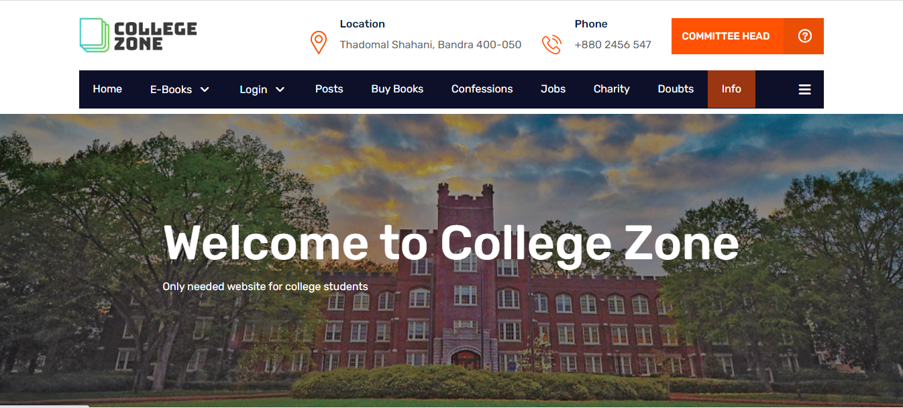
</p>

<br />

### Table Of Content

- [Architecture](#architecture-and-design)
- [Design](#design)
- [Demonstration & Features](#demonstration)
- [Technologies Used](#technologies-used)
- [Local Setup & Contributing](#contributing)
- [License](#license)
- [Authors](#authors)

<br />

### Problem we are trying to solve?

There are many websites and apps available today for publishing announcements such as Instagram, Facebook, etc. But they are not intended for this, as their primary job is to entertain us by share photos, and reels.


Many juniors ask their doubts on watsaap group which has capacity of only 250 members.How can all the juniors be on same group same goes for seniors.This leads to lack of connectivity and knowledge.


After sems get over the need of that sem’s book is no more . They can be sold to juniors but who will connect them with seniors. 


**Problems with the exisiting sytem?**

The current solutions assumes to have 2 platforms 

- Another, Many juniors ask their doubts on watsaap group which has capacity of only 250 members.How can all the juniors be on same group same goes for seniors.This leads to lack of connectivity and knowledge.

- There are many websites and apps available today for publishing event related announcements such as Instagram, Facebook, etc. But they are not intended for this, as their primary job is to entertain us by share photos, and reels.

- And another, after sems get over the need of that sem’s book is no more . They can be sold to juniors but who will connect them with seniors. 

I wanted to solve this issue by developing a website that solves each of the above problems efficiently.

### Market & User Research

- On market research, the products available found, are not college specific.
- On user research and feedback from students, UX of such platforms isn't upto the mark.
- Committee Heads wanted to bring their post on top of user's feed.
- Client wanted a scaled doubt solving platform.

That's where we come into picture.
<br />


## Architecture and Design

The tradeoff in a Passion: `Strive strive till you succeed`

But something that I am proud of is,I tried to follow ideal software development practices.

- Architecture
- Design
- Code
<br />

The presentation for College Zone can be found [here](https://docs.google.com/presentation/d/1c1aiarGRYCKzakMDGuvS1Ny7yLW4jqwd/edit?usp=sharing&ouid=102697595023867264508&rtpof=true&sd=true).

### Architecture

- The architecture and workflow was built using [excalidraw](https://excalidraw.com) and it is freaking [brilliant](https://github.com/excalidraw/excalidraw).
<br />
<!--  -->
<br />

### Design

- The designs were built using [Figma](figma.com) and were brought to life with [HBS](https://handlebarsjs.com/).


<!-- <br />
  
<br /> -->

## Demonstration

<br />

**Landing Page**

<p align="left">
  
  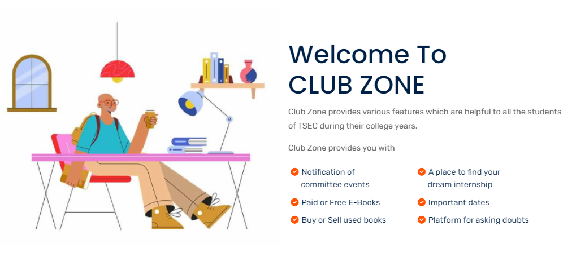
  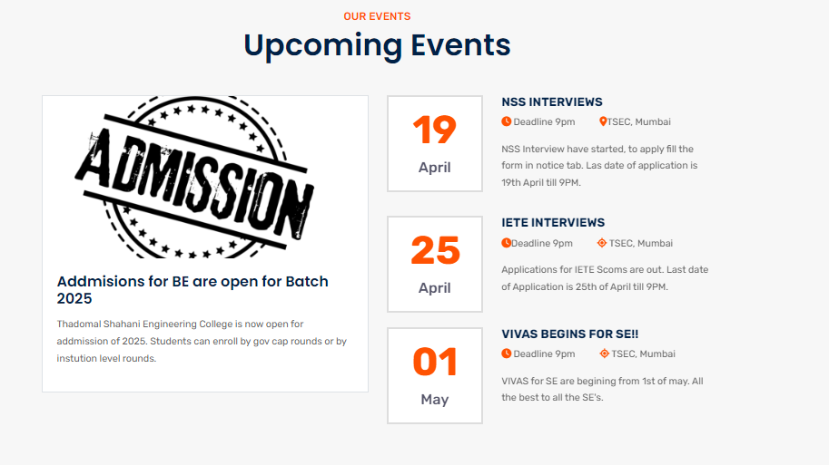
</p>

<br />
<br />

**Register & Login For Committe Head**
<br />

<table>
    <tr>
        <td>
            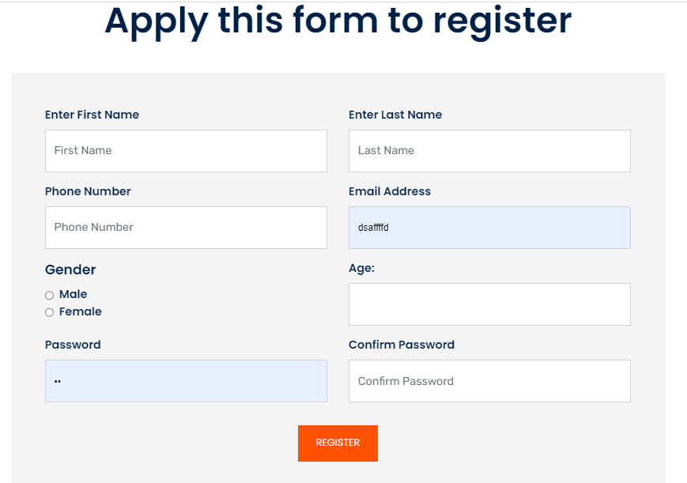
        </td>
        <td>
            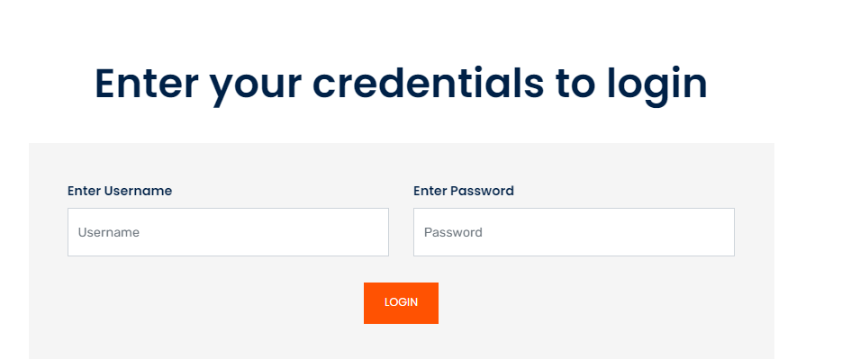
        </td>
    </tr>
    <tr>
        <td>
          <p>Registration - Fill out the form.</p>
        </td>
        <td>
          <p>Login with proper credentials.</p>
        </td>
    </tr>
</table>

<br />

**Register & Login For User**
<br />

<table>
    <tr>
        <td>
            
        </td>
        <td>
            
        </td>
    </tr>
    <tr>
        <td>
          <p>Registration - Fill out the form.</p>
        </td>
        <td>
          <p>Login with proper credentials.</p>
        </td>
    </tr>
</table>


<br />

**Uploading Post**

- Provinding platform for various committees to post their announcements, wherein students can login to get information about various events such as hackathons and participate in them.

- After logging in and entering the unique post upload page.
- Filling out the neccessary details to market upcoming events:
  -  Event Name
  -  Description
  -  Registration Link
  -  Thumbnail
  -  Contact info
<br />

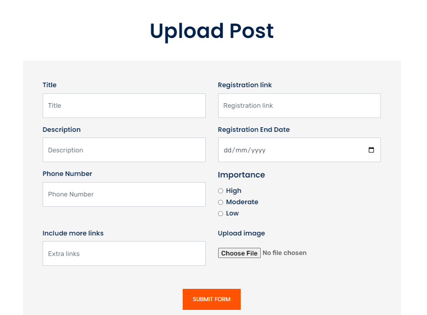


<br />

**Surfing all the post**

- Surf committee’s posts to find your’s interseted one 
- The uploaded posts then can be easily accessed by students interested in them. One can get notified when a new event has occurred. They don’t have to rely on other social platforms such as instagram, facebook for getting notification.

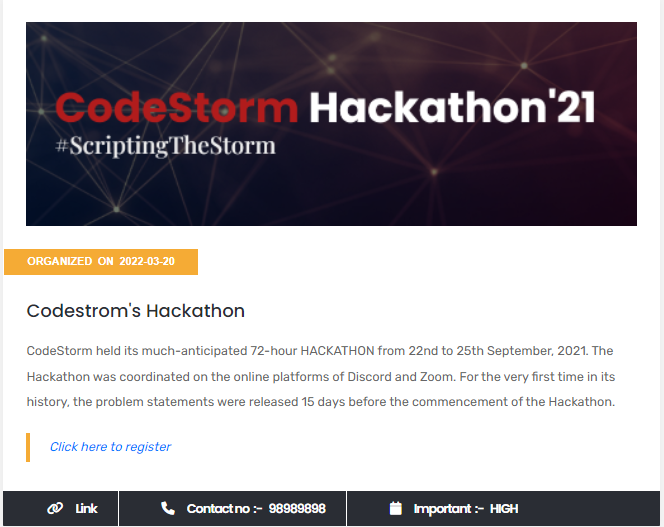

<br />

<!-- **Checks for cheating** -->

<!-- - Face Verification
- Voice Detection
- Multiple People Detection
- Dev Tools Check
- Multiple Tabs Check
- Full Screen Check -->

<br />

**Asking Doubts**

- Ask n no of doubts shich will be solved by expertise all across the world.
- Get advice by knowledgeble fellow
- During entire course of enginnering, students face lots of problems and diificulties. For which they sometimes need a golden advice or a simple solution.
Here students can post their query and get advice from the knowledgeble friend or senior.

- Put your doubts with nesessare details :
  -  Doubt Title
  -  Doubt


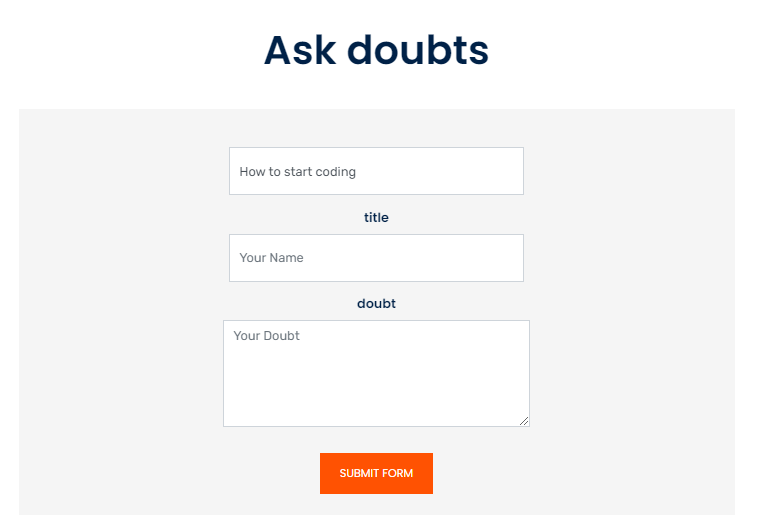
<br />
 
**Doubts viewing and answering page**

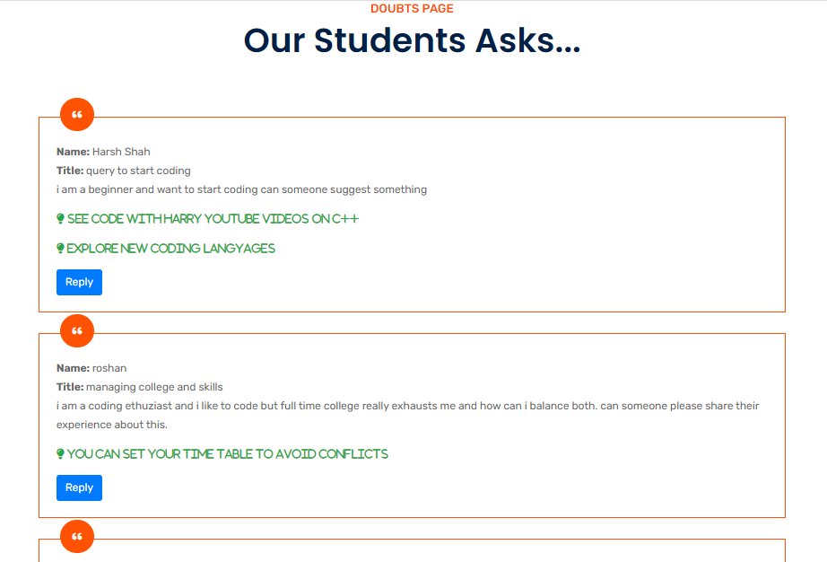

<br />

**Sell Books**

- Sell your used books. 

- Provision for buying used books of seniors for cheap. This helps both, the senior to get money from book and the student to get book for less price, thereby reducing the wastage of paper. 

- Market your books by sharing  :
  -  Book Name
  -  Price
  -  Description
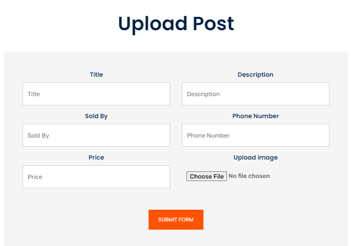  
<br />

**Browsing books page**

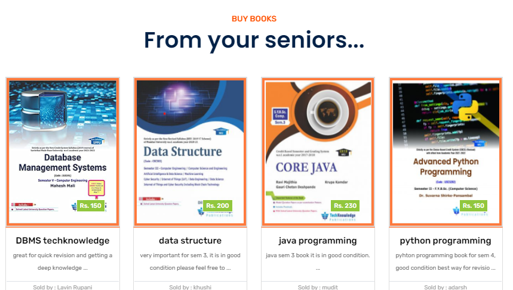

<br />

**Confess Something**

- Confess about anything with no hasitation 

- Confession serves as a gate to let ourselves out, and let in whatever we need. It strengthens a person's sense of empowerment. You feel less helpless, less hopeless, less negative about yourself.

- Confess this by  :
  -  Confession Name
  - Confession


<br />

**See all the confessions at one page**

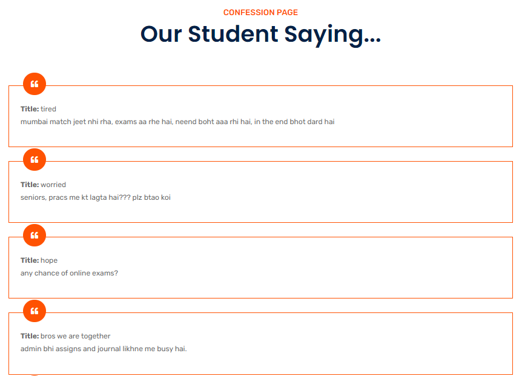

<br />

**Information Center**

- Share your valuable information with people across the world.
- Share it by filling out  :
  -  Information about
  - Information
<br />

**See all the valuable resources at one page**

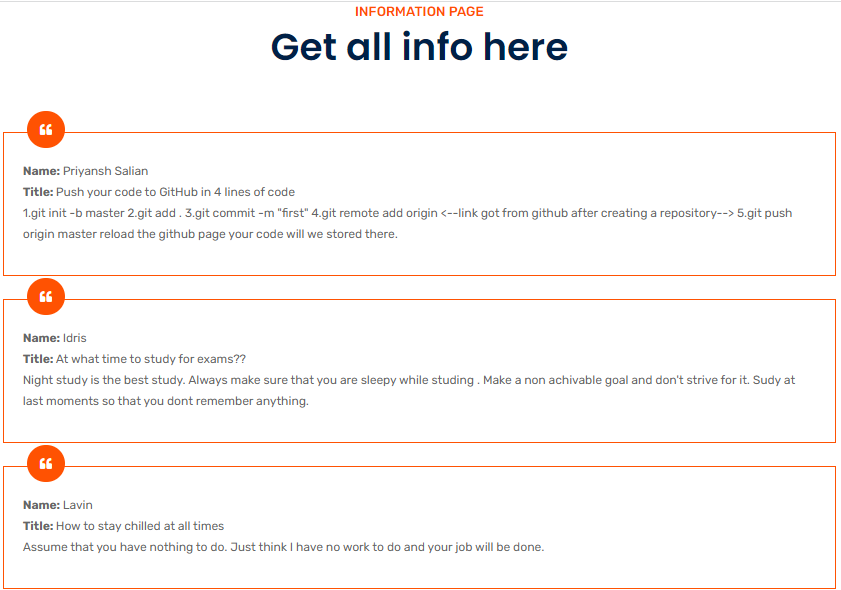

<br />

**Ebooks**

- Easily access free or paid E-books on click of fingers
- Reference books online . We provide free as well as paid e-books for the students

- Details provided about each book are :
  -  Book name
  -  Book Description
  - Sold By
  - Reviews
<br />

**Surf through free as well as paid books**


<br />

**Internship**

- Get a source of income & experience 
- Find your relevant internship, and spend time working on relevant projects, learning about the field, making industry connections, and developing both hard and soft skills. Also get a chance to earn full-time job offers.


- Details provided about each internships are :
  -  Company name
  - Post offered
  - Description
  - Location
  - Apply Link
<br />

**Surf through all internships at one go**

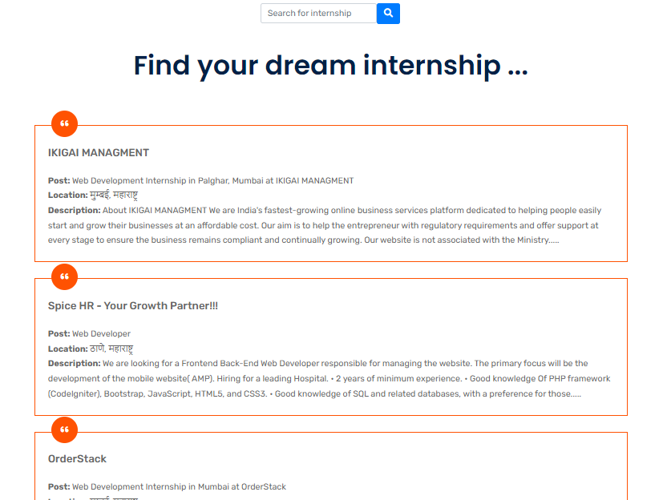

<br />

**Charity**

- Donate sources to the needy

- Students can donate their non required belonging or money in charity and  to relieve the needs of indigent, ill, or helpless persons, or of animals.
And do something good for society.

- Details provided about each Charity are :
  -  Charity name
  - Website to donate
  - Description
  
<br />

**Surf through all charities at one go**


<br />

**Complementary Pages**

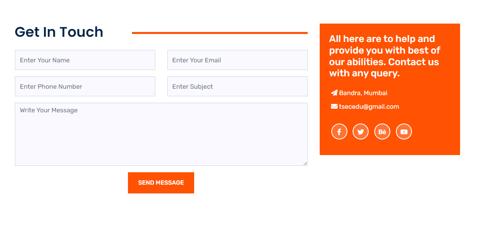
<table>
    <tr>
        <td>
            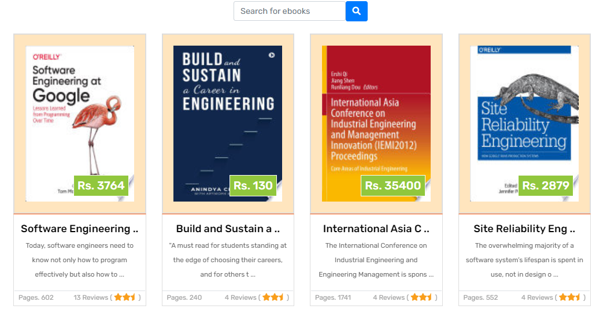
        </td>
        <td>
            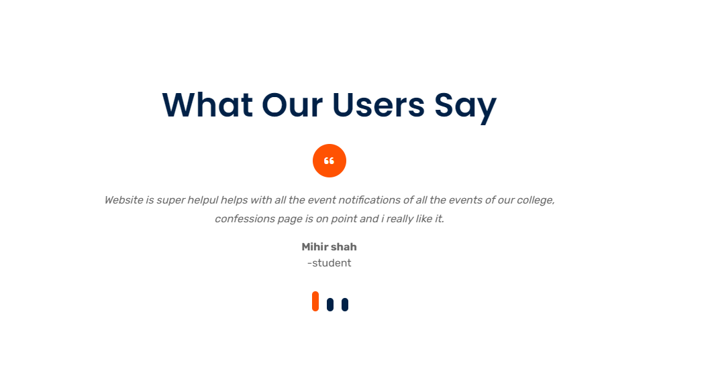
        </td>
    </tr>
    <!-- <tr>
        <td>
            
        </td>
        <td>
            
        </td>
    </tr> -->
</table>

<br />

Also, **ideas rejected**: These were rejcted due to false positives and load on website seamless functionality.

- Chat Bot
- Like botton on doubts and post page.
- Specalist Dashboard to check if the given ans is correct or not

<br />


**Committee Head Dashboard**

- Can only view and upload event Posts.

<br />

<table>
    <tr>
        <td>
            
        </td>
        <td>
            
        </td>
    </tr>
    <!-- <tr>
        <td>
          <p>Test Dashboard: Admin can see statistics - no. of students with warnings and above the threshold.</p>
        </td>
        <td>
          <p>Admin Dashboard: Admin can Terminate or Continue a students exam based on warnings.</p>
        </td>
    </tr> -->
</table>


<br />

**User Dashboard**

- Can view/upload Information,Doubts,Confession and Books.
- Can view Event Posts,Charities,Jobs and Ebooks

<br />

<table>
    <tr>
        <td>
            
        </td>
        <td>
            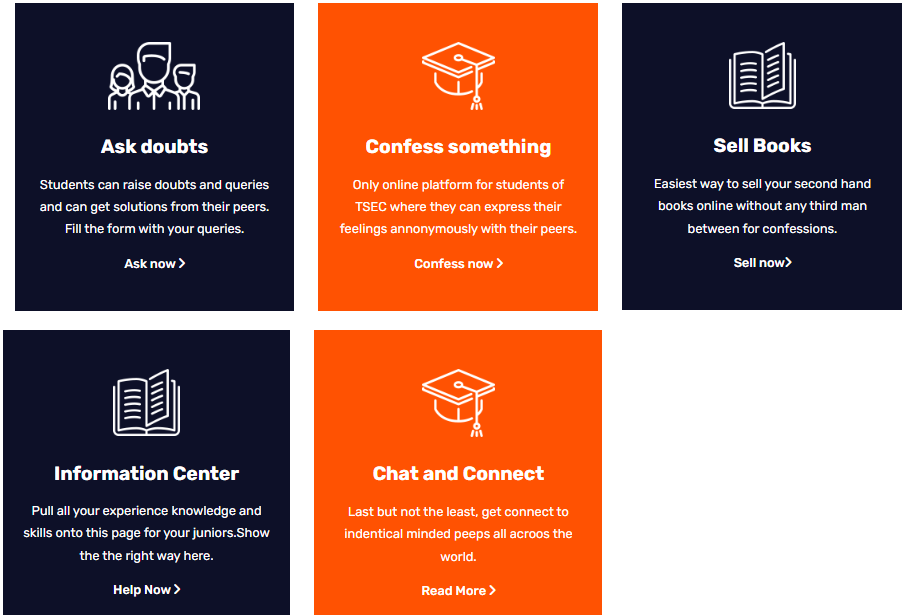
        </td>
    </tr>
    <!-- <tr>
        <td>
          <p>Test Dashboard: Admin can see statistics - no. of students with warnings and above the threshold.</p>
        </td>
        <td>
          <p>Admin Dashboard: Admin can Terminate or Continue a students exam based on warnings.</p>
        </td>
    </tr> -->
</table>
</br>

## Technologies Used

<br />

- Workflow and Architecture Design
  - Excalidraw
- Prototyping and Frontend Design
  - Figma
- Frontend
  - HBS
  - HTML
  - JAVA SCRIPT
  - BOOTSTRAP
  - CSS
- Backend
  - Node.js (Express.js)
  - MongoDB Atlas
- Middleware
  - JSON WEB TOKEN

<br />

**Dependencies**

A freaking huge shoutout to:
<!-- - [react-webcam](https://www.npmjs.com/package/react-webcam)
- [devtools-detect](https://www.npmjs.com/package/devtools-detect)
- [react-chartjs-2](https://www.npmjs.com/package/react-chartjs-2)
- [chartjs](https://www.npmjs.com/package/chartjs) -->
- "bcrypt": "^5.0.1",
- "bcryptjs": "^2.4.3",
- "body-parser": "^1.20.0",
- "cookie-parser": "^1.4.6",
- "dompurify": "^2.3.6",
- "dotenv": "^16.0.0",
- "expres": "^0.0.5",
- "express": "^4.17.3",
- "form-data": "^4.0.0",
- "fs": "0.0.1-security",
- "google-search-results-nodejs": "^2.1.0",
- "hbs": "^4.2.0",
- "https": "^1.0.0",
- "isomorphic-unfetch": "^3.1.0",
- "jsdom": "^19.0.0",
- "jsonwebtoken": "^8.5.1",
- "mongoose": "^6.1.6",
- "mongoose-slug-generator": "^1.0.4",
- "multer": "^1.4.4",
- "nodemailer": "^6.7.2",
- "nodemon": "^2.0.15",
- "path": "^0.12.7"
<br />
<br />

## Contributing

**Local Setup || Project Structure**

NOTE: Individual instructions can be found in respective directories.

- The project contains 4 broad directories.

```
*
├───client
├───middleware
├───model
└───server
```

- `client`: The frontend for the application.
- `middleware`: Authenticating the user and admin.
- `model`: Model APIs for Machine Learning.
- `server`: The backend for the application.

<br />

**Client**

Structure

```
Root directory
├───assets
├───post-assets
├───templates

```

Individual Component & Container Structure example

```
assets
├───css
└───style.css
```

<br />
<br />

<!-- **Extension**

Read [this](https://github.com/tusharnankani/LeadsTracker#using-this-extension) or [this](https://github.com/dheerajdlalwani/back-to-work/#how-to-install) for a brief description for installing extensions.
- Open new tab & type: `chrome://extensions` or `edge://extensions`.
- Look for the Developer mode toggle & turn it on if it's not already.
- After cloning the repository, click on `Load Unpacked` and select the `extension` directory.

<br />
<br /> -->

**Model**

The complete setup can be found in the [Database directory](/src/models/).

Structure

```
models
├───contactus.js
├───confess.js
├───doubt.js
├───register.js
├───model.js
├───postdata.js
├───sell_book.js

```
<br />

**Server**

For local setup of backend:

- `npm i`
- `npm run devStart`
- Go to `localhost:5000`

```
server
├───middlewares
├───models
├───routes
└───package.json
```
The complete setup can be found in the [package.json](/package.json).
<br />
<br />

### License 📜

[GNU General Public License v3.0](/LICENSE)


### Authors

- Priyansh Salian 
  - [LinkedIn](https://www.linkedin.com/in/priyansh-salian-6a74a621a)


<sub>Changing lives through technology.</sub>
